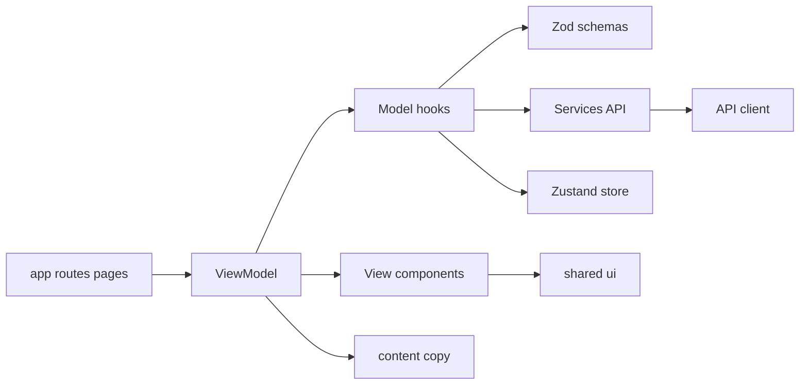
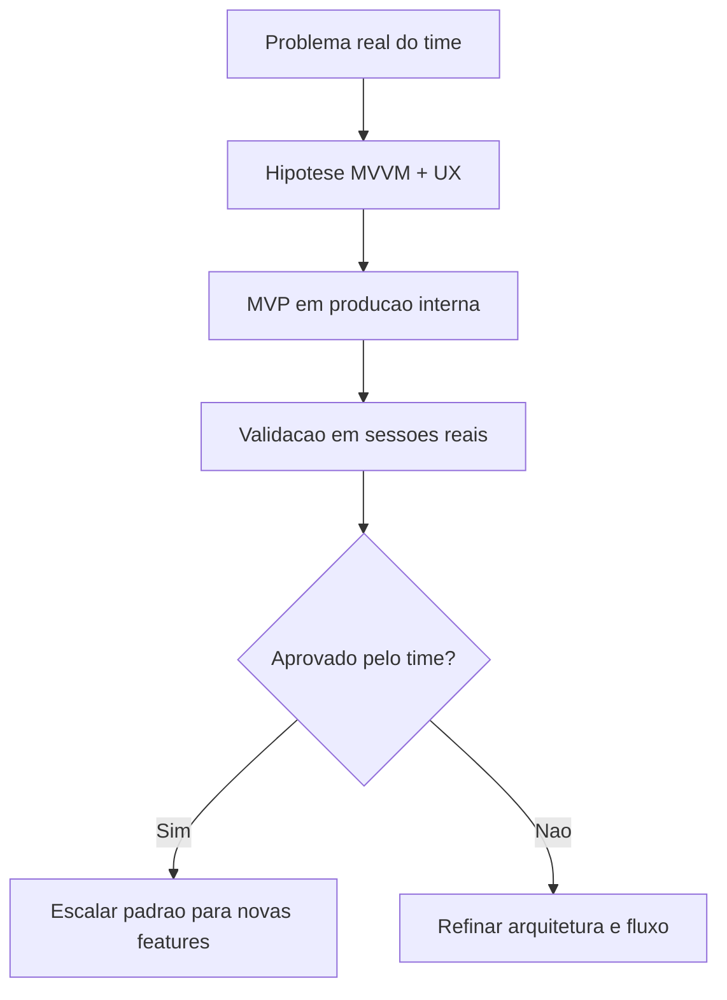
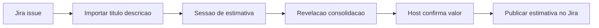

# Planning Poker

Plataforma de estimativa agil criada para resolver uma dor real de time: **estimar backlog sem friccao operacional**.

> Este repositorio nao e apenas uma implementacao de interface. Ele documenta um experimento de produto + arquitetura para validar se MVVM, aplicado de forma pragmatica, melhora velocidade de evolucao e qualidade de uso em sessoes reais.

## Indice

- [1) Contexto da descoberta](#1-contexto-da-descoberta)
- [2) Problema que estamos atacando](#2-problema-que-estamos-atacando)
- [3) Hipotese de produto e engenharia](#3-hipotese-de-produto-e-engenharia)
- [4) Tese do produto](#4-tese-do-produto)
- [5) Principios de design e experiencia](#5-principios-de-design-e-experiencia)
- [6) Arquitetura e decisoes tecnicas](#6-arquitetura-e-decisoes-tecnicas)
- [7) Fluxo alvo com Jira](#7-fluxo-alvo-com-jira)
- [8) Estado atual validado](#8-estado-atual-validado)
- [9) Riscos e perguntas abertas](#9-riscos-e-perguntas-abertas)
- [10) Roadmap por ondas](#10-roadmap-por-ondas)
- [11) Stack atual](#11-stack-atual)
- [12) Como rodar localmente](#12-como-rodar-localmente)
- [13) Qualidade e testes](#13-qualidade-e-testes)
- [14) Estrutura do projeto](#14-estrutura-do-projeto)
- [15) Contribuicao](#15-contribuicao)

## 1) Contexto da descoberta

Este projeto nasce de duas frentes que normalmente andam separadas:

1. **Descoberta tecnica**: validar MVVM na pratica para decidir se o time adota esse padrao como base de features futuras.
2. **Descoberta de produto**: eliminar atritos que tornam Planning Poker cansativo em ferramentas atuais.

A pergunta central foi:

**Como transformar estimativa em um fluxo continuo (entender issue -> discutir -> estimar -> registrar), sem exigir burocracia para comecar?**

## 2) Problema que estamos atacando

Em rotinas reais de sprint planning, vimos um padrao repetido:

- tempo perdido para abrir e configurar sessao;
- UX confusa para quem so quer entrar e estimar;
- limitacoes de uso por plano gratuito em ferramentas terceiras;
- retrabalho de copiar contexto e resultado entre sala de estimativa e Jira.

Resultado: a dinamica de estimativa deixa de ser uma conversa sobre valor e vira operacao de ferramenta.

## 3) Hipotese de produto e engenharia

Hipotese de validacao deste repositorio:

1. **Se** a regra de negocio ficar separada da camada visual (MVVM),
2. **e se** o fluxo de entrada for guest-first,
3. **e se** o fechamento da estimativa voltar ao Jira sem friccao,

**entao** teremos maior adesao do time, menor custo operacional e evolucao de codigo mais previsivel.

## 4) Tese do produto

Nosso posicionamento:

- Estimar nao deveria exigir conta obrigatoria.
- Conta deve existir, mas como opcional para historico e continuidade.
- O host precisa trabalhar com contexto da issue dentro da sala.
- A estimativa final precisa retornar ao Jira com o minimo de passos.

Em uma frase: **menos ritual de ferramenta, mais foco na decisao de produto/engenharia.**

## 5) Principios de design e experiencia

- **Guest-first**: entrar na sala em segundos.
- **Account-optional**: conta para historico, nao para bloquear participacao.
- **Context-in-room**: trazer a issue para dentro da conversa.
- **Host-driven closeout**: consolidar e publicar resultado sem retrabalho.
- **Low-friction UI**: reduzir cliques e mudanca de tela em fluxo critico.

## 6) Arquitetura e decisoes tecnicas

### 6.1 Decisao arquitetural principal: MVVM por feature

A aplicacao foi estruturada em torno de features (`auth`, `rooms`) com separacao explicita:

- `View`: composicao visual e acessibilidade;
- `Model`: estado, validacao, regras e efeitos;
- `ViewModel`: ponte entre contrato visual e comportamento.

Isso permite:

- trocar UI sem quebrar regra de negocio;
- evoluir comportamento mantendo contratos claros;
- testar fluxo com maior previsibilidade.

### 6.2 Diagrama de camadas



### 6.3 Diagrama de descoberta para entrega



### 6.4 Decisoes tecnicas implementadas

- Feature-first (`src/features`) para manter dominio coeso.
- Validacao com `zod` + `react-hook-form` para contrato de formulario.
- Sessao local com `zustand` para continuidade de uso.
- Servico de auth com fallback demo para nao bloquear evolucao de UX.
- Testes E2E e component com Cypress para proteger fluxo principal.

## 7) Fluxo alvo com Jira

A integracao com Jira e um pilar do produto, nao um extra cosmetico.

### 7.1 Fluxo pretendido



### 7.2 Resultado esperado

- menos troca de contexto;
- menos copia e cola;
- maior rastreabilidade entre discussao e estimativa final.

## 8) Estado atual validado

### 8.1 O que ja existe no codigo

- Rotas de acesso: `/login`, `/signup`, `/forgot-password`, `/rooms/[code]`.
- Modo visitante e modo conta no fluxo de entrada.
- Etapa de sala apos autenticacao no fluxo de conta.
- Configuracao de sala com persistencia local de preferencias.
- Sessao local com `zustand`.
- Cobertura Cypress para fluxo de login (E2E + component).

### 8.2 O que esta parcial

- Autenticacao: existe tentativa via API e fallback demo no servico.
- Experiencia de sala: base pronta, sem backend real-time completo.

### 8.3 O que ainda e planejado

- Integracao Jira (importar contexto + publicar estimativa).
- Motor de rodada sincronizado entre participantes.

## 9) Riscos e perguntas abertas

- Qual o nivel de acoplamento aceitavel entre feature e copy para escalar internacionalizacao?
- Quais limites de estado local antes de migrar partes para server state em tempo real?
- Como equilibrar guest-first com governanca de historico e auditoria?
- Qual recorte minimo de Jira entrega valor sem complexidade excessiva?

## 10) Roadmap por ondas

### Onda 1 - Consolidacao do MVP (curto prazo)

- [x] Fluxo de entrada visitante/conta
- [x] Cadastro e recuperacao de senha (camada de UI/model)
- [x] Configuracao de sala
- [x] Base de testes Cypress
- [ ] Ajustes finais de experiencia e mensagens de fluxo

### Onda 2 - Sessao colaborativa real-time

- [ ] Backend de sala e participantes
- [ ] Presenca em tempo real (join/leave)
- [ ] Estado de rodada sincronizado
- [ ] Regras de host e permissoes

### Onda 3 - Jira-first workflow

- [ ] Conexao com workspace/projeto Jira
- [ ] Importacao de titulo/descricao para contexto da sala
- [ ] Publicacao da estimativa final pelo host
- [ ] Tratamento de falhas e retries no envio

### Onda 4 - Escala e inteligencia de produto

- [ ] Historico por sala/time
- [ ] Metricas de convergencia de estimativas
- [ ] Observabilidade (logs, traces, dashboards)
- [ ] Pipeline de qualidade para CI/CD

## 11) Stack atual

### Frontend

- Next.js (App Router)
- React 19
- TypeScript
- Tailwind CSS 4
- shadcn/ui
- lucide-react

### Estado, formularios e dados

- Zustand
- React Hook Form
- Zod
- Axios
- TanStack React Query

### Qualidade

- ESLint
- Cypress (E2E + Component)
- Typecheck (app + cypress)

### Infra

- Dockerfile
- Docker Compose

## 12) Como rodar localmente

1) Copiar variaveis de ambiente:

```bash
cp .env.example .env.local
```

2) Instalar dependencias:

```bash
npm install
```

3) Rodar em desenvolvimento:

```bash
npm run dev
```

Aplicacao local: `http://localhost:3000`

## 13) Qualidade e testes

### Validacoes estaticas

```bash
npm run lint
npm run typecheck
npm run typecheck:cypress
npm run build
```

### Testes Cypress

```bash
npm run cy:open
npm run cy:run:e2e
npm run cy:run:component
npm run test:e2e
npm run test:component
```

Arquivos de referencia:

- `cypress/e2e/login.cy.ts`
- `cypress/component/login-view.cy.tsx`
- `cypress/support/commands.ts`

## 14) Estrutura do projeto

```text
src/
|- app/
|  |- login/
|  |- signup/
|  |- forgot-password/
|  \- rooms/[code]/
|- core/
|  |- api/
|  |- config/
|  |- providers/
|  |- store/
|  |- theme/
|  \- utils/
|- shared/
|  \- ui/
\- features/
   |- auth/
   |  |- components/
   |  |- hooks/
   |  |- services/
   |  |- types/
   |  |- content/
   |  \- utils/
   \- rooms/
      |- components/
      |- hooks/
      |- types/
      \- content/
```

## 15) Contribuicao

Contribuicoes sao bem-vindas, principalmente em:

- evolucao do fluxo MVVM por feature;
- experiencia de estimativa com foco em baixa friccao;
- estrategia de integracao Jira com robustez operacional.

Padrao sugerido para novas features:

1. Criar em `src/features/<feature-name>`.
2. Separar `components`, `hooks`, `types`, `content`, `services`.
3. Expor entrada pelo `index.ts` da feature.
4. Cobrir com teste de componente e, quando fizer sentido, E2E.

---

Se este experimento provar valor em sessoes reais, a proxima etapa e transformar esta base no padrao oficial de desenvolvimento para o time.
