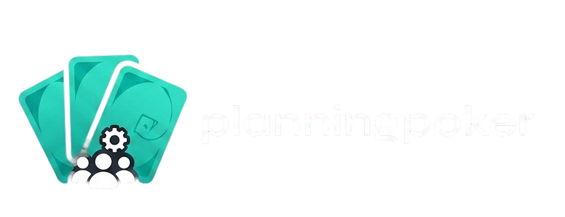
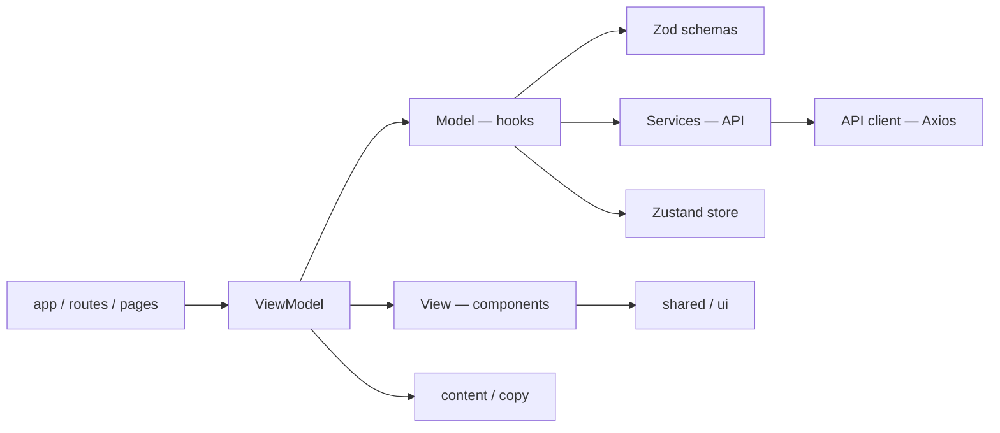
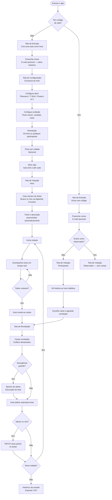
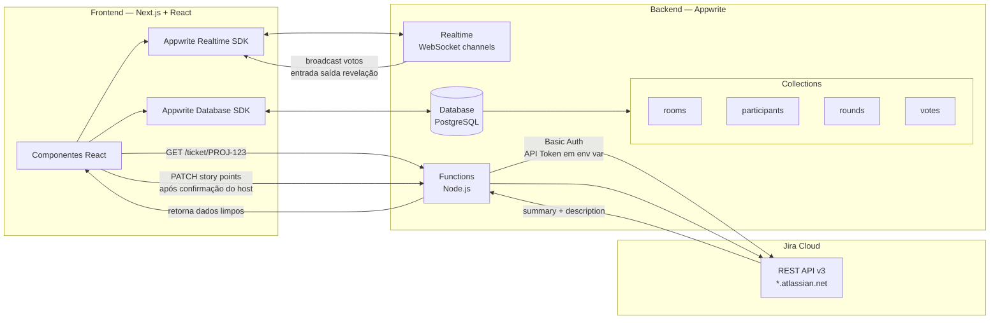
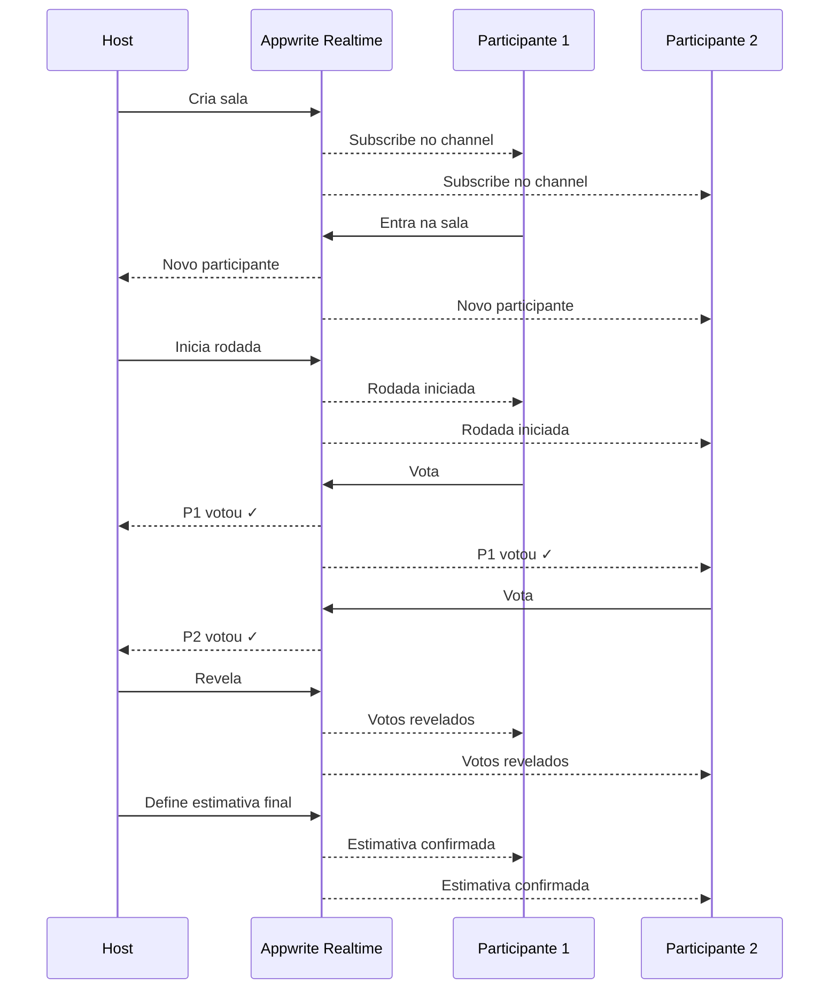
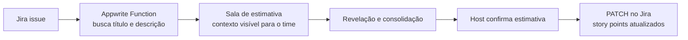
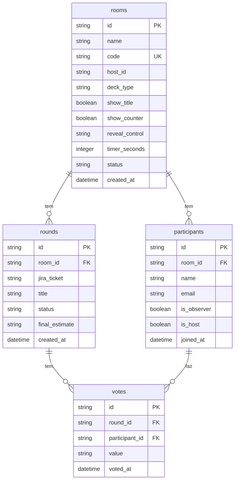

<div align="center">
  

  <br />
  <br />


  <br />


  <br />


  <br />
  <br />

  <p><em>Estimativa ágil sem fricção. Sem cadastro obrigatório. Sem rotatividade de email. Sem planos pagos.</em></p>

</div>

<br />

## Como tudo começou

Todo sprint, a mesma sequência. Alguém tenta abrir o Planning Poker, a ferramenta pede login, o plano gratuito bateu no limite, precisa criar um email novo, outro integrante não consegue entrar, a reunião atrasa quinze minutos, e a estimativa que deveria ser uma conversa sobre complexidade vira uma operação de suporte técnico.

Em algum momento, o time parou e fez a pergunta óbvia: por que uma ferramenta tão simples precisa ser tão cara e tão cheia de atrito?

A resposta foi que não precisava. Então começamos a construir a nossa.

O projeto nasceu com dois objetivos que normalmente andam separados. O primeiro é de produto: eliminar cada ponto de fricção que transforma estimativa em burocracia. O segundo é técnico: validar MVVM aplicado de forma pragmática como padrão para features futuras do time. Os dois caminham juntos aqui.

<br />

## O que a gente estava cansado de fazer

Identificamos um padrão que se repetia toda semana. Tempo perdido abrindo e configurando sessão. Rotatividade de email para driblar limite de plano gratuito. UX confusa para quem só quer entrar e votar. Retrabalho de copiar o contexto do Jira para a sala. E a estimativa final que não voltava automaticamente para o ticket — alguém sempre precisava lembrar de atualizar na mão.

O efeito mais silencioso de tudo isso é que a dinâmica de estimativa para de ser uma conversa sobre valor e vira uma operação de ferramenta.

<br />

## O que estamos testando

A hipótese que guia o projeto é direta. Se a regra de negócio ficar separada da camada visual, e se o fluxo de entrada não exigir cadastro, e se o contexto da issue viajar do Jira direto para a sala, e se a estimativa final voltar ao ticket sem nenhum passo extra — então o time vai aderir, o custo operacional vai cair, e o código vai ser mais fácil de evoluir.

É isso que estamos validando em sessões reais.

<br />

## Princípios que guiam cada decisão

**Guest-first.** Entrar na sala em segundos, sem cadastro. A conta existe para quem quer salvar histórico, não para bloquear quem só quer estimar.

**Context-in-room.** A issue do Jira viaja para dentro da sala. O time vota com o título e a descrição visíveis, sem abrir outra aba.

**Host-driven closeout.** O host revela as cartas, consolida a estimativa e publica no Jira. Tudo dentro da mesma tela, sem retrabalho.

**Zero rotatividade de email.** Uma URL, qualquer pessoa do time entra. Fim.

<br />

## Arquitetura e decisões técnicas

### MVVM por feature

A aplicação é organizada em torno de features com separação explícita de responsabilidades. A View cuida da composição visual e acessibilidade. O ViewModel faz a ponte entre o contrato visual e o comportamento. O Model concentra estado, validação, regras e efeitos colaterais.

Isso significa que dá para trocar a UI sem quebrar regra de negócio, evoluir comportamento sem mexer em componente, e testar fluxo com previsibilidade real.



### Por que Zustand e não Redux

Redux foi avaliado. A decisão foi deliberada.

O estado do Planning Poker não é complexo o suficiente para justificar a estrutura do Redux. São basicamente `room`, `participants`, `rounds` e `votes`. O Appwrite Realtime já cuida da sincronização entre clientes — o store Zustand vira um espelho local limpo do que chega pelo WebSocket. O bundle do Zustand é de ~3kb contra ~47kb do Redux, e o boilerplate cai pra quase zero.

A separação por feature já está feita. Se o projeto crescer ao ponto de precisar do Redux, a migração não exige reescrever a arquitetura.

<br />

## Fluxo de telas



<br />

## Arquitetura técnica



<br />

## O que acontece por baixo em tempo real



<br />

## Integração com Jira

A integração não é um extra cosmético. É um pilar. O objetivo é acabar com a troca de contexto entre a ferramenta de estimativa e o backlog.



O Jira Cloud usa API Token gerado em `id.atlassian.com/manage-profile/security/api-tokens`. As credenciais ficam em variáveis de ambiente na Appwrite Function — nunca no frontend. O CORS do Jira bloqueia chamadas diretas do browser, então a Function atua como proxy seguro entre o cliente e a API do Jira.

<br />

## Schema do banco



<br />

## O que já está feito e o que vem

O projeto está organizado em ondas. A primeira consolida o MVP — fluxo de entrada com modo visitante e modo conta, cadastro e recuperação de senha, configuração de sala, estado local com Zustand e cobertura inicial com Cypress. A maior parte está pronta, os ajustes finais de UX estão em andamento.

A segunda onda conecta o backend realtime: sala e participantes via Appwrite, presença em tempo real, estado de rodada sincronizado entre todos os clientes, regras de host, timer por rodada e modo observador.

A terceira onda é onde a integração com Jira entra de verdade: busca de ticket por número, importação de título e descrição para o contexto da sala, publicação da estimativa final no ticket pelo host e tratamento de falhas no envio.

A quarta onda é sobre escala e inteligência: histórico por sala e time, métricas de convergência de estimativas, exportação de sessão em CSV, QR code de sala, observabilidade e pipeline de CI/CD.

<br />

## Stack

**Frontend:** Next.js 16 com App Router, React 19, TypeScript 5, Tailwind CSS 4 e shadcn/ui.

**Estado, formulários e dados:** Zustand 5 para estado global, React Hook Form com Zod 4 para formulários e validação, TanStack Query 5 para cache e dados assíncronos, Axios para HTTP.

**Qualidade:** Cypress 14 para E2E e testes de componente, ESLint 9, typecheck configurado tanto para app quanto para Cypress.

**Infraestrutura:** Docker com Docker Compose para ambiente reproduzível, Appwrite para database, realtime, functions e auth.

<br />

## Como rodar localmente

Clone o repo, copie as variáveis de ambiente e instale as dependências:

```bash
git clone https://github.com/bythealice/planning_poker.git
cd planning_poker
cp .env.example .env.local
npm install
npm run dev
```

A aplicação sobe em `http://localhost:3000`. Se preferir Docker:

```bash
cp .env.example .env.local
docker compose up --build
```

<br />

## Qualidade e testes

Validações estáticas:

```bash
npm run lint
npm run typecheck
npm run typecheck:cypress
npm run build
```

Testes Cypress:

```bash
npm run cy:open           # abre a interface interativa
npm run cy:run:e2e        # roda todos os testes E2E
npm run cy:run:component  # roda testes de componente
npm run test:e2e          # E2E com servidor local
npm run test:component    # componentes
npm run test:e2e:ci       # build + start + cypress para CI
```

Os arquivos de referência estão em `cypress/e2e/login.cy.ts`, `cypress/component/login-view.cy.tsx` e `cypress/support/commands.ts`.

<br />

## Estrutura do projeto

```
src/
├── app/
│   ├── login/
│   ├── signup/
│   ├── forgot-password/
│   └── rooms/[code]/
├── core/
│   ├── api/
│   ├── config/
│   ├── providers/
│   ├── store/
│   ├── theme/
│   └── utils/
├── shared/
│   └── ui/
└── features/
    ├── auth/
    │   ├── components/
    │   ├── hooks/
    │   ├── services/
    │   ├── types/
    │   ├── content/
    │   └── utils/
    └── rooms/
        ├── components/
        ├── hooks/
        ├── types/
        └── content/
```

<br />

## Contribuição

Contribuições são bem-vindas, especialmente na evolução do fluxo MVVM por feature, na experiência de estimativa com foco em baixa fricção e na estratégia de integração com Jira.

Para novas features, o padrão é criar em `src/features/<feature-name>`, separar `components`, `hooks`, `types`, `content` e `services`, expor a entrada pelo `index.ts` da feature e cobrir com teste de componente e, quando fizer sentido, E2E.

<br />

<div align="center">
  <p>Feito com frustração real e código de verdade. 🃏</p>
</div>
